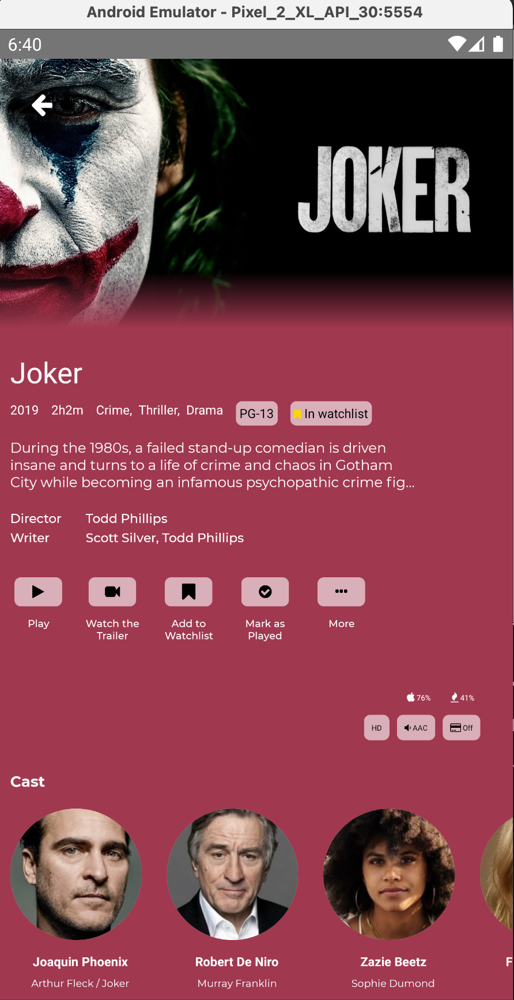
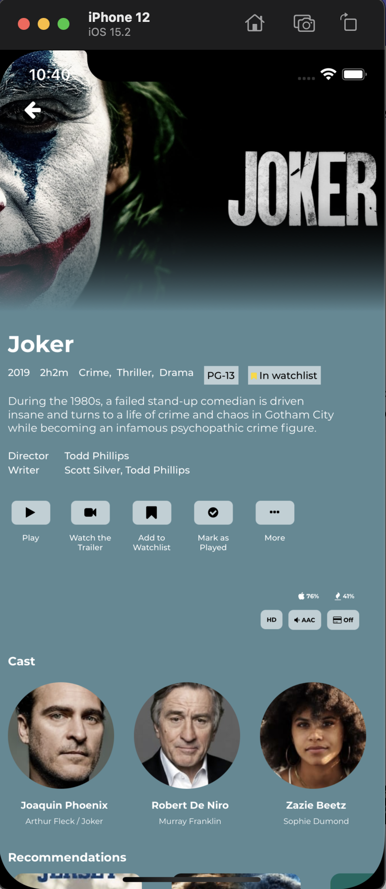
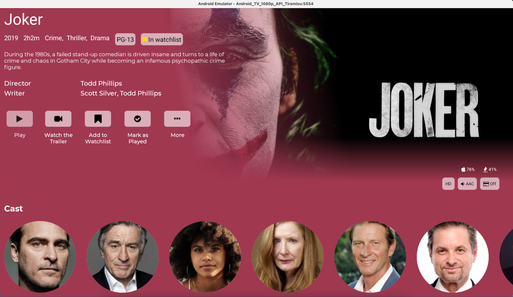

# OTT-APP

A React Native based Over-The-Top (OTT) media service application designed for seamless deployment across a wide range of platforms:

* **Mobile:** Android, iOS
* **Smart TVs:** Android TV, Apple TV
* **Web:** Modern web browsers




## Table of Contents

* [Features](#features)
* [Getting Started](#getting-started)
    * [Prerequisites](#prerequisites)
    * [Installation](#installation)
    * [Running the App](#running-the-app)
* [Technology Stack](#technology-stack)
* [Contributing](#contributing)
* [License](#license)
* [Contact](#contact)

## Features

* **Cross-Platform Compatibility:** Single codebase for multiple platforms.
* **High-Quality Video Streaming:** Optimized for smooth playback.
* **User Authentication:** Secure user login and registration.
* **Content Management:** Easy organization and categorization of media.
* **Search and Discovery:** Intuitive search and content discovery features.
* **Responsive UI:** Adaptable interface for various screen sizes.
* **Playback Controls:** Standard playback controls (play, pause, seek, volume).
* **Adaptive Bitrate Streaming (ABR):** Dynamic video quality adjustment.
* (Add other specific features of your app here)




## Getting Started

### Prerequisites

Before you begin, ensure you have the following installed:

* [Node.js](https://nodejs.org/) (LTS recommended)
* [npm](https://www.npmjs.com/) or [Yarn](https://yarnpkg.com/)
* [React Native CLI](https://reactnative.dev/docs/environment-setup)
* [Android Studio](https://developer.android.com/studio) (for Android development)
* [Xcode](https://developer.apple.com/xcode/) (for iOS and Apple TV development)
* (Add any other specific prerequisites for your project)

### Installation

1.  Clone the repository:

    ```bash
    git clone [https://github.com/Mahesh-Dev94/OTT-APP.git](https://github.com/Mahesh-Dev94/OTT-APP.git)
    cd OTT-APP
    ```

2.  Install dependencies:

    ```bash
    npm install  # or yarn install
    ```

3.  (Add any platform specific installation instructions here)

### Running the App

* **Android:**

    ```bash
    npx react-native run-android
    ```

* **iOS:**

    ```bash
    npx react-native run-ios
    ```

* **Web:**

    ```bash
    npx react-native start
    # Then open your browser at the prompted url.
    ```

* **Android TV/Apple TV:**
    * (Add specific instructions for tv here)

## Technology Stack

* **React Native:** Core framework
* **JavaScript/TypeScript:** Programming language
* (Add any other relevant libraries or frameworks)

## Contributing

Contributions are welcome! Please follow these steps:

1.  Fork the repository.
2.  Create a new branch (`git checkout -b feature/your-feature`).
3.  Make your changes.
4.  Commit your changes (`git commit -am 'Add some feature'`).
5.  Push to the branch (`git push origin feature/your-feature`).
6.  Create a new Pull Request.

## License

(Add your license information here. For example, MIT License)

## Contact

* Mahesh Vishwakarma - [ionictest2017@gmail.com](mailto:ionictest2017@gmail.com)
* Project Link: [https://github.com/Mahesh-Dev94/OTT-APP](https://github.com/Mahesh-Dev94/OTT-APP)

# after Installing node modules, 
# Go to node_modules -> react-native-web-> dist -> modules-> prefixStyles -> Static.js
1. Remove line 1 backgroundClip and its dependencies
# Go to node_modules -> react-native-web-> src -> modules-> prefixStyles -> Statics.js
1. Remove line 1 backgroundClip and its dependencies

# after Installing node modules, 
# Go to node_modules -> react-native-image-colors-> lib -> index.js->
1. Replace -> line 15 -> const resolvedSrc = resolveImageSource(source);
 with 
 
let resolvedSrc = null;
  if(Platform.OS === "web"){
    resolvedSrc = source.uri;
  }else{
    resolvedSrc = resolveImageSource(source);
  }
 
